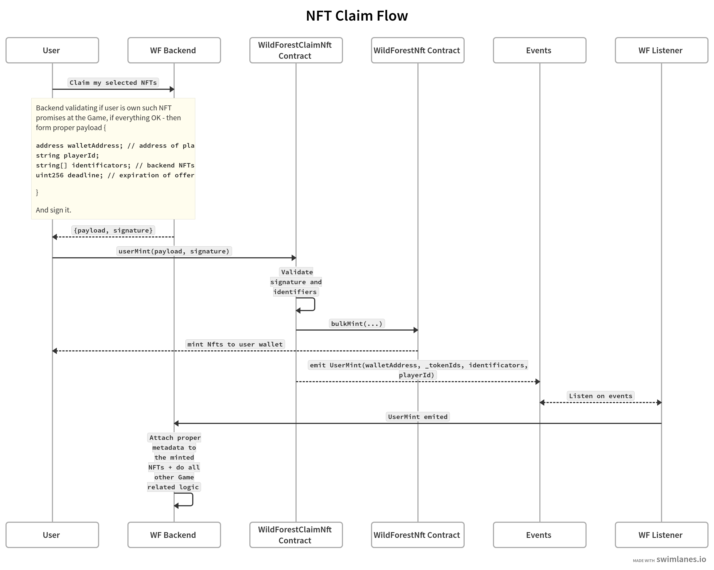

#NFT

##ERC721 based (WildForestNft)
Its proxy Smart Contract with Pause functionallity.
It have have role based permissions (MINTER_ROLE, PAUSER_ROLE, DEFAULT_ADMIN_ROLE) roles.
It have extra bulk operations to perform on several tokens (bulkMint, bulkApprove, bulkBurn)
(Main use cases - its to use bulkMint to create NFTs for some wallet and bulkApprove + bulkBurn to burn them)

##ERC1155 based (WildForestMedalStorage)
Its proxy Smart Contract with option to create new types(intenrally called seasons) by the Admin
From second version it have have role based permissions (MINTER_ROLE, TYPE_CREATOR_ROLE, DEFAULT_ADMIN_ROLE) roles (had just initial governance address which had a power to execute all functions).

## WildForestClaimNft
Its proxy Smart Contract main function of which is add an option for the users to mint NFTs (which they own at the Game) by themselfs.

For this using `userMint` method. Our backend validating preparing and signing payload, 
which then used by the end user to call userMint function, 
which checks if the signature done by our trusted backend address and valid - then its
minting NFTs for this address.

Address of this (WildForestClaimNft) contract added as `MINTER_ROLE` at the `WildForestNft` contract,
so this contract could mint NFTs

#TOKEN

##ERC20 based (WildForestToken)
This just clean ERC20 contract

## WildForestClaimTokenTransfer
Its proxy Smart Contract main function of which is add an option for the users to obtain/get transfered to them tokens (which they own at the Game) by themselfs.

Users using userTransfer method of contract with payload and signature parameter provided by our backend.
Contract checking that signature is correct for the payload and done by out trusted backend address.
And doing the ERC20 tokens transfer to the user address. (From on of our backend addresses, which owns the tokens. This backend wallet did approve of his ERC20 tokens to this WildForestClaimTokenTransfer contract)

# Self Claim Flow
